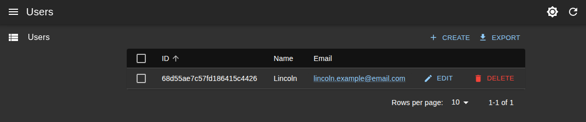
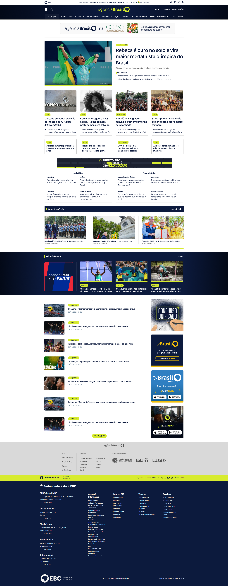

# Front-End Software Engineer Portfolio  

---

## 📖 About This Portfolio  

This portfolio highlights a selection of **front-end engineering projects** where I combined modern web technologies (React, TypeScript, Next.js, Tailwind) with a **UX-oriented approach**.  

These case studies represent both **real-world projects at EBC (Empresa Brasil de Comunicação)** and **personal demos** designed to explore advanced stacks and workflows relevant to companies like ICEYE.  

---

## 🚀 Featured Projects  

### 1. Satellite Fleet Dashboard (Demo Project)  
  

**Tech stack:** React, TypeScript, Tailwind, REST/GraphQL mock APIs  

**Description:**  
Inspired by ICEYE’s mission, this demo simulates a **dashboard for managing a satellite fleet**, including orbital visualization, ground-station connections, and scheduling.  

**Highlights:**  
- Built a **responsive dashboard layout** with reusable components.  
- Integrated mock APIs (REST/GraphQL) to simulate real-time data handling.  
- Applied accessibility best practices with ARIA roles and focus management.  
- Demonstrated ability to design and code interfaces for **complex, distributed systems**.  

**Links:**  
- 🎨 [Figma Design](#) (placeholder)  
- 💻 [GitHub Repository]() (placeholder)  

---

### 2. User Management System (React Admin Demo)  
  

**Tech stack:** React, React Admin, Node.js, MongoDB, Cypress  

**Description:**  
Developed during my postgraduate UX Engineering course, this project demonstrates building a **data management tool** with CRUD operations, authentication, and automated testing.  

**Highlights:**  
- Implemented with **React Admin** on the front end, connected to a **custom Node.js + MongoDB backend**.  
- Added **E2E tests** using Cypress to validate workflows like create, edit, and delete.  
- Focused on usability and performance in forms and list views.  
- Example of **enterprise-like application architecture** using modern frameworks.  

**Links:**  
- 💻 [GitHub Repository](https://github.com/Lincoln-Araujo/user_system_admin)  

---

### 3. Agência Brasil Redesign (EBC Project)  
  

**Tech stack:** Plone CMS, HTML, CSS, JavaScript, Figma  

**Description:**  
Agência Brasil is the official federal news agency in Brazil. I contributed to the **redesign of its website**, solving accessibility and SEO challenges while modernizing the front end.  

**Highlights:**  
- Built responsive layouts aligned with **WCAG accessibility standards**.  
- Improved **SEO performance**, enabling Agência Brasil’s election coverage to rank among the most-read news on the web during municipal elections.  
- Partnered with designers, editors, and stakeholders to implement a user-centered redesign.  
- The new platform reached **millions of readers**, reinforcing the importance of scalability and maintainability.  

**Links:**  
- 🌍 [Website](https://agenciabrasil.ebc.com.br)  
- 🎨 [Figma Design](https://www.figma.com/design/hsDVBIzafTKMqrrcqR7G3G/Ag%C3%AAncia-Brasil---novo-tema?node-id=1015-2&t=gdcVx24D1m6alkg5-1)  

---

## 📚 Key Learnings  

Through these projects I practiced and demonstrated:  
- ⚛️ **Modern frameworks** – React, Next.js, TypeScript, Tailwind, React Admin.  
- ♿ **Accessibility in practice** – WCAG compliance, ARIA, semantic HTML.  
- 🧩 **Reusable architectures** – components, design patterns, maintainable code.  
- 🧪 **Testing mindset** – unit tests (Vitest) and system tests (Cypress).  
- 🤝 **Collaboration** – bridging design and development to ship user-centered solutions.  

---

## 🔗 More  

- 📂 [Other GitHub Repositories](https://github.com/Lincoln-Araujo?tab=repositories)  
- 💼 [LinkedIn Profile](https://www.linkedin.com/in/lincolnaraujo/)  

---

✨ This portfolio is a **focused selection of projects** showcasing how I combine **front-end engineering skills with UX mindset** to design and deliver accessible, reliable, and user-centered solutions.
